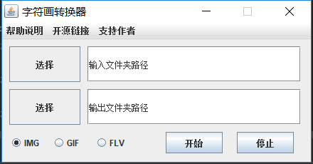

# IMG2ASC

## 字符画转换原理

基本原理是颜色深的区域用笔画更复杂的字符替换，因此整体看起来可以保持原本的图画轮廓。

用到了一个[彩色转灰度](https://blog.csdn.net/xdrt81y/article/details/8289963)的算法，Gray = R*0.299 + G*0.587 + B*0.114。

## 窗口程序使用说明

封装了一个JFrame界面进程，提供对IMG、GIF、FLV（未完成）的多线程处理支持。选择输入和输出的文件夹路径，点击开始即可开始转换逻辑。

当前默认的像素处理速度参数Speed为4，后期将优化为可选。

## Reference

1.[Java实现图片(Image)转字符(ASCII)图片](https://my.oschina.net/xshuai/blog/1927629)

[源码地址](https://gitee.com/xshuai/imagetool)

2.[【开源项目】将图片转换为字符画](https://www.cnblogs.com/xiaoxi666/archive/2018/02/18/8452717.html)

[源码地址](https://github.com/xiaoxi666/Img2AsciiVision)

3.[一个简单的图片转字符画程序(C++实现)](https://www.jianshu.com/p/1f58a0ebf5d9)

[源码地址](https://github.com/Sundae97/Image2Characters)

4.[将普通图片转化为字符画(Python)](https://blog.csdn.net/Shreck66/article/details/51464843)
